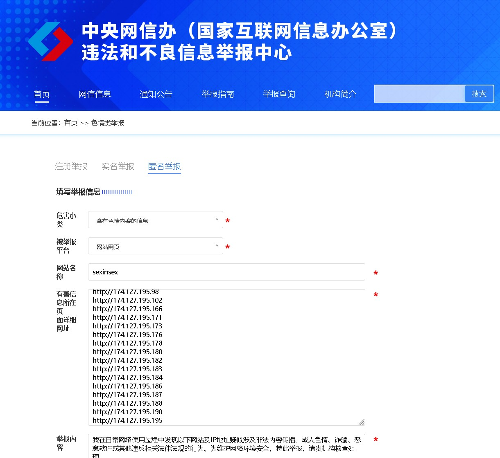

# sexinsex.net
SEXINSEX 色中色 最新域名 和 IP地址 投诉举报用

# 关于悬赏 SEXINSEX犯罪集团 所有运营团队成员个人信息 netpolice@bj.cyberpolice.cn      

## 📄 投诉举报模板（适用于电邮或在线表单）

你可以根据具体举报平台（如加拿大网络安全机构、中国12377、美国IC3等）调整格式和语言。

```
主题：举报涉嫌非法或不良内容网站

尊敬的网络安全/执法机构：

我在日常网络使用过程中发现以下网站及IP地址疑似涉及非法内容传播、成人色情、诈骗、恶意软件或其他违反相关法律法规的行为。为维护网络环境安全，特此举报，请贵机构核查处理。

【举报网站列表】
- sexinsex.net
- sis.xxx
- bluerockcafe.com
- yaayaa.net
- gapipi.com
- nihao3.net
- …（完整列表见附件或下方）

【举报IP地址】
- 174.127.195.196
- 174.127.195.202
- 108.160.135.234
- …（完整列表见附件或下方）

【补充说明】
- 这些网站多数内容不透明，运营者匿名，疑似通过跳转、伪装等方式规避监管。
- 部分域名存在镜像、跳转、伪装行为，可能用于传播不良信息或诱导用户下载恶意程序。
- 我已整理完整域名与IP清单，供贵方参考。

感谢贵机构对网络安全的维护。如需进一步信息，我愿协助提供。

举报人：
举报时间：2025年10月28日  
联系方式：（可选）

附件：域名与IP清单.txt
```

---

## 🧭 举报渠道推荐

| 地区 | 举报平台 | 链接 |
|------|-----------|------|
| 加拿大 | Cybertip.ca | [https://www.cybertip.ca](https://www.cybertip.ca) |
| 中国大陆 | 12377 举报中心 | [https://www.12377.cn](https://www.12377.cn) |
| 美国 | IC3 网络犯罪中心 | [https://www.ic3.gov](https://www.ic3.gov) |
| 全球 | Google Safe Browsing | [https://safebrowsing.google.com](https://safebrowsing.google.com) |



---

## 📂 域名与IP清单

请参考 [`domain_ip_list.txt`](./domain_ip_list.txt) 文件，包含已整理的可疑域名与IP地址。

---

## 🤝 参与方式

- 提交新的可疑域名或IP地址
- 更新举报渠道信息
- 分享举报经验或成功案例

欢迎通过 Pull Request 或 Issue 参与贡献！

---

## 📜 免责声明

本项目仅用于公益举报与网络安全研究，不涉及任何非法用途。请勿滥用信息。

```
